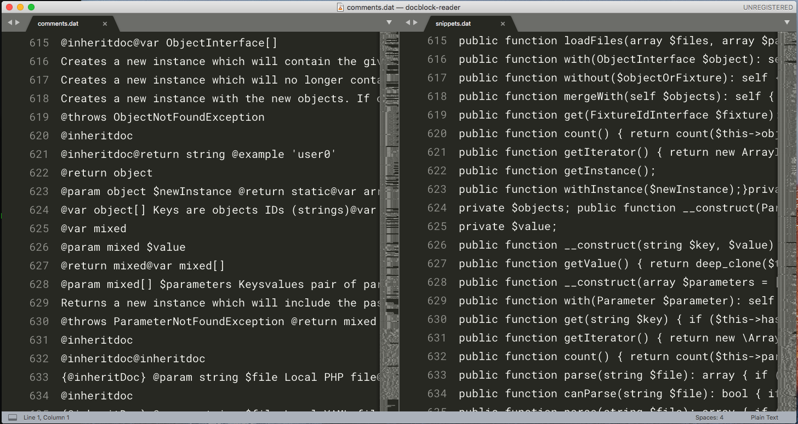

# The Personal Rasmus Lerdorf

Imagine that you had Rasmus Lerdorf sitting next to you. Rasmus can comment PHP code for you.

This proof-of-concept uses 443 PHP libraries from GitHub to train a Deep Learning TensorFlow Language Translator.

## Facts about the dataset

We have prepared the data by writing comments and PHP snippets into two files [comments.dat](comments.dat) and [snippets.dat](snippets.dat). Line 615 in [snippets.dat](snippets.dat) has its respective comment in line in 615 in [comments.dat](comments.dat):

|  |
| :--: |
| Read [obtaining the data yourself](obtaining-data/generating-the-data.md) if you are interested in how we got this data |

 * A total of 34,105 PHP files in the dataset 
 * 33,116 (97.10%) had accompanying PSR Docblocks that could be parsed
 * 989 files (2.90%) were skipped due to incomplete/missing PSR Docblocks.
 * Resulting data set is 181,937 rows (88 MB).

## Mining the data

### Test